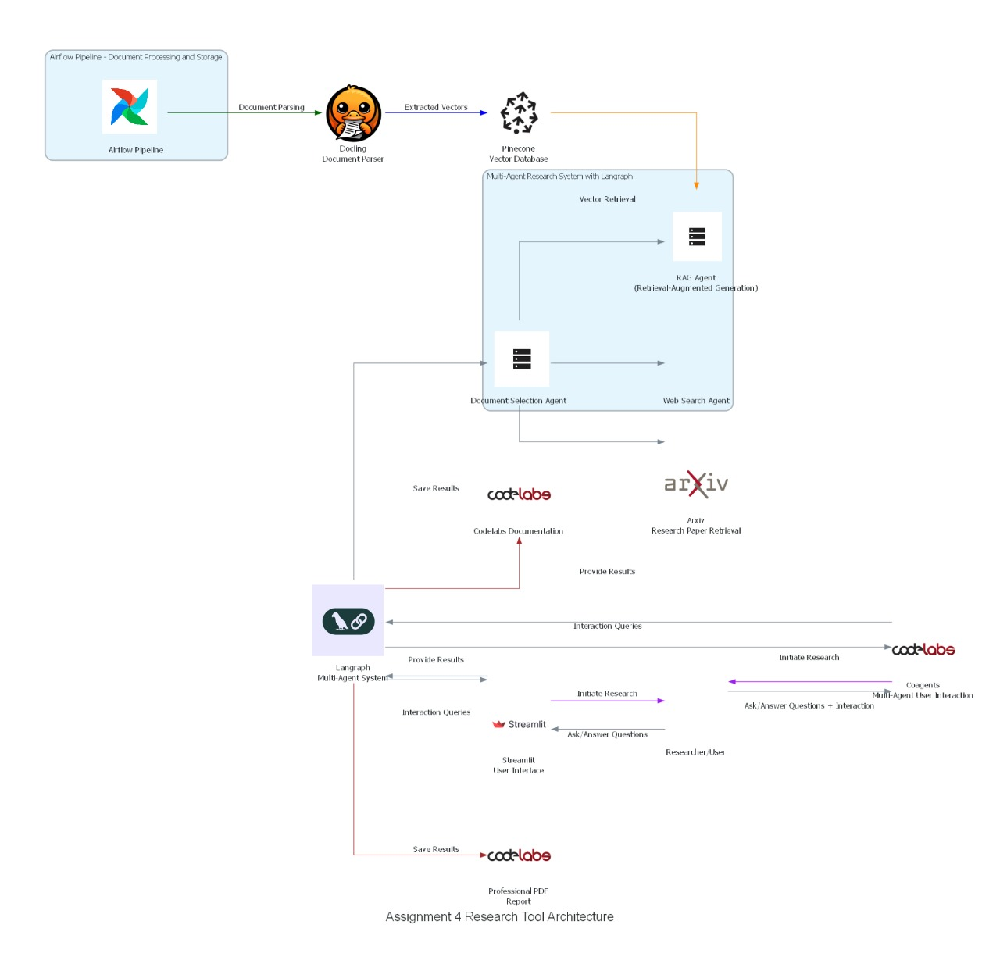

# Document Processing and Research Tool

This project is an end-to-end research tool designed to process documents, store and search document vectors, and create a multi-agent research interface. The system utilizes an Airflow pipeline to automate document processing, vector storage, and document-based Q&A capabilities.

---

## 🏆 Objective

The primary objective is to develop a research tool that:

- Parses documents and stores document vectors for similarity-based search.
- Creates a multi-agent system for document-based research.
- Provides an interactive interface for question-answering (Q&A) and research interactions.
---

## 🛠️ Project Components

### 1. Airflow Pipeline for Document Processing and Vector Storage

- **Document Parsing:** Uses [Docling](https://github.com/DS4SD/docling) for parsing documents and extracting text.
- **Vector Storage:** Uses [Pinecone](https://www.pinecone.io/) to store document vectors for fast, scalable similarity search.
- **Pipeline Automation:** Airflow automates the document parsing and vector storage process, integrating Docling with Pinecone.

### 2. Multi-Agent Research System

- **Agent Setup:** Uses [Langraph](https://langchain-ai.github.io/langgraph/tutorials/introduction/) to create agents capable of:
  - **Document-based research** using processed vectors.
  - **Arxiv search** for related academic papers.
  - **Web-based search** for extended research context.
  - **Retrieval-Augmented Generation (RAG)** for document-based Q&A.

### 3. Research Interface and Q/A Interaction

- **User Interface:** Developed using **Streamlit** or **Coagents** (bonus feature), allowing users to interact with document content by asking questions and retrieving answers.
- **Results Export:** Generates a professional PDF report and an instructional Codelabs document based on research findings.

---

## 📋 Requirements

- [Airflow](https://airflow.apache.org/) for workflow orchestration.
- [Docling](https://github.com/DS4SD/docling) for document parsing.
- [Pinecone](https://www.pinecone.io/) for vector storage.
- [Langraph](https://langchain-ai.github.io/langgraph/tutorials/introduction/) for multi-agent setup.

---
## Project Links
- [Codelabs](https://codelabs-preview.appspot.com/?file_id=1yNnt1rujAKCxuPQZfn5caNeriK9FtuuvPX_qEk91zVk#5) for
- [Video presentation](https://drive.google.com/drive/u/0/folders/1VozeLR1GTBusVJXih_fo1F7lMnY-L-HG) for the whole walk through of the project
- [Deployment link](http://18.227.228.223:8501) Full live project deployment 
---

## Architecture Diagram


---
## 🚀 Setup Instructions

1. **Clone the Repository:**

   ```bash
   git clone <repository_url>
   cd <repository_directory>

2.	**Install Dependencies:**
	•	Ensure Python is installed, then set up a virtual environment.
	•	Install the required dependencies with:

pip install -r requirements.txt


3.	**Configure Airflow:**
	•	Airflow Setup: Define and configure Airflow DAGs for document processing.
	•	Docling and Pinecone Integration: Configure Docling for document parsing and connect it with Pinecone for vector storage.


**Example Configuration:**
	•	Set up Docling configurations for parsing the dataset.
	•	Configure Pinecone API keys and environment in the Airflow pipeline settings.


4.	**Run the Pipeline:**
	•	Start the Airflow server to initiate the pipeline:

  bash
  airflow webserver -p 8080
  airflow scheduler

  •	Trigger the pipeline DAG to begin document parsing and vector storage in Pinecone.

5	**Launch the Research Interface:**
	•	Run the research interface using Streamlit (or Coagents, if configured) for user interaction:

streamlit run app.py
	•	Access the interactive Q&A and research tools from the interface.

---
💻 Usage
1. Document Processing:
• The Airflow pipeline automates the parsing of documents, storing them as vectors in Pinecone for similarity search.
2. Research Interaction:
• Select processed documents for research.
• Interact with agents to conduct Arxiv searches, retrieve additional web context, and use the RAG model for Q&A on document content.
3. Results Export:
• Export findings as a PDF report and structure them into a Codelabs document for future reference.

---
📑 Submission Requirements
Github Repository: Provide a project summary, proof of concept, issue tracker, and a 5-minute solution overview video.

Diagrams and Documentation: Include architecture diagrams, detailed Codelabs documentation, and alink to the hosted application.

📚 References
• Docling GitHub Repository
• Pinecone Documentation
• Langraph Introduction
• Google Codelabs Format Guide

This streamlined section provides clearer instructions for configuration, running the pipeline, and launching the user interface, along with usage guidelines and submission requirements. Let me know if you need further customization!
